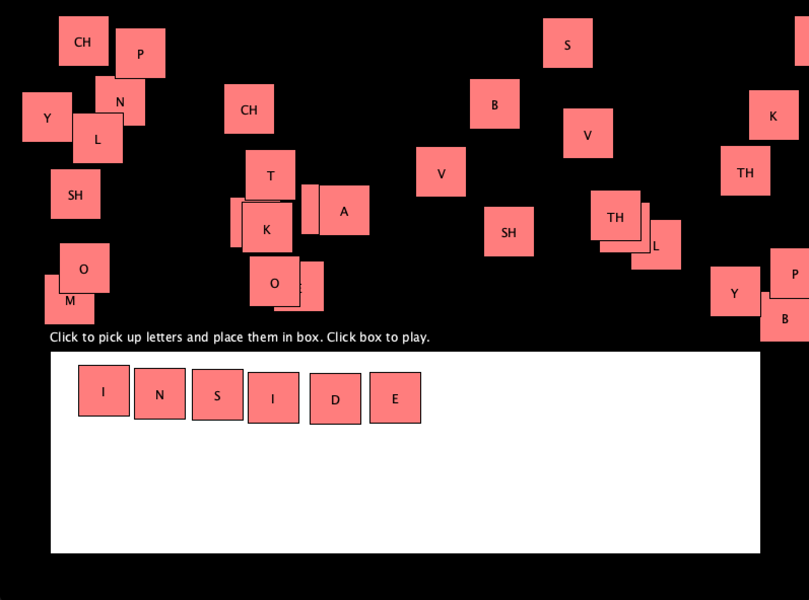

This is a simple game to help school kids practice their phonetics.

Squares containing letters appear randomly all over the screen. Players can click on them to pick them up and place them into a white box. They can then click anywhere in that white box to play the sounds of each letter in the box in sequence.

## Executables

See the [dist/](./dist/) directory for executables to run on Windows, Mac, or Linux computers.

## Code

The game is written in [p5.js](https://p5js.org).
